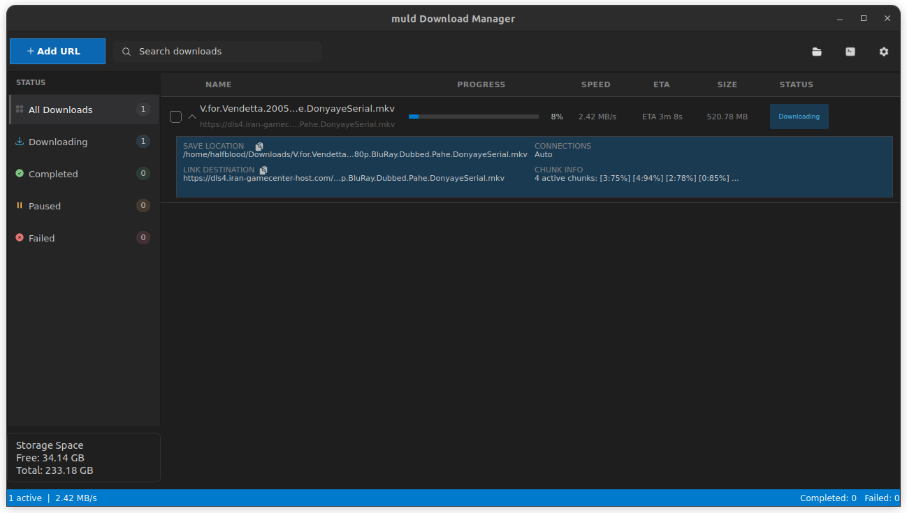

#  muld-gui

A lightweight desktop GUI for `muld`.

note: `muld-gui` is a toy project I developed during war. It is not a serious project. Tt uses `muld` as the backend.
Backend repository: [muld](https://github.com/Arash1381-y/muld)



## What it does

- Add and manage download URLs in a desktop UI
- Track download progress, speed, and state
- Pause, resume, remove, and retry downloads
- Search and filter downloads from the main view
- Perform bulk actions from selection mode

## Tech stack

- C++17
- Qt6 (`Core`, `Widgets`, `Svg`)
- `muld` backend library
- CMake

## Build

### Prerequisites

- CMake 3.16+
- A C++17 compiler
- Qt6 development packages
- `muld` installed and discoverable by CMake (`find_package(muld REQUIRED)`)

### Linux build steps

```bash
cmake -S . -B build
cmake --build build -j
./build/muld-gui
```

## Project structure

- `src/` — application source code (UI, controller, models, core logic)
- `assets/` — README/demo assets
- `dist/linux/` — Linux packaging metadata and app icon

## Notes

- This repository also includes packaging artifacts such as AppImage and `.zip` bundles.
- The app is currently focused on Linux desktop workflows.
